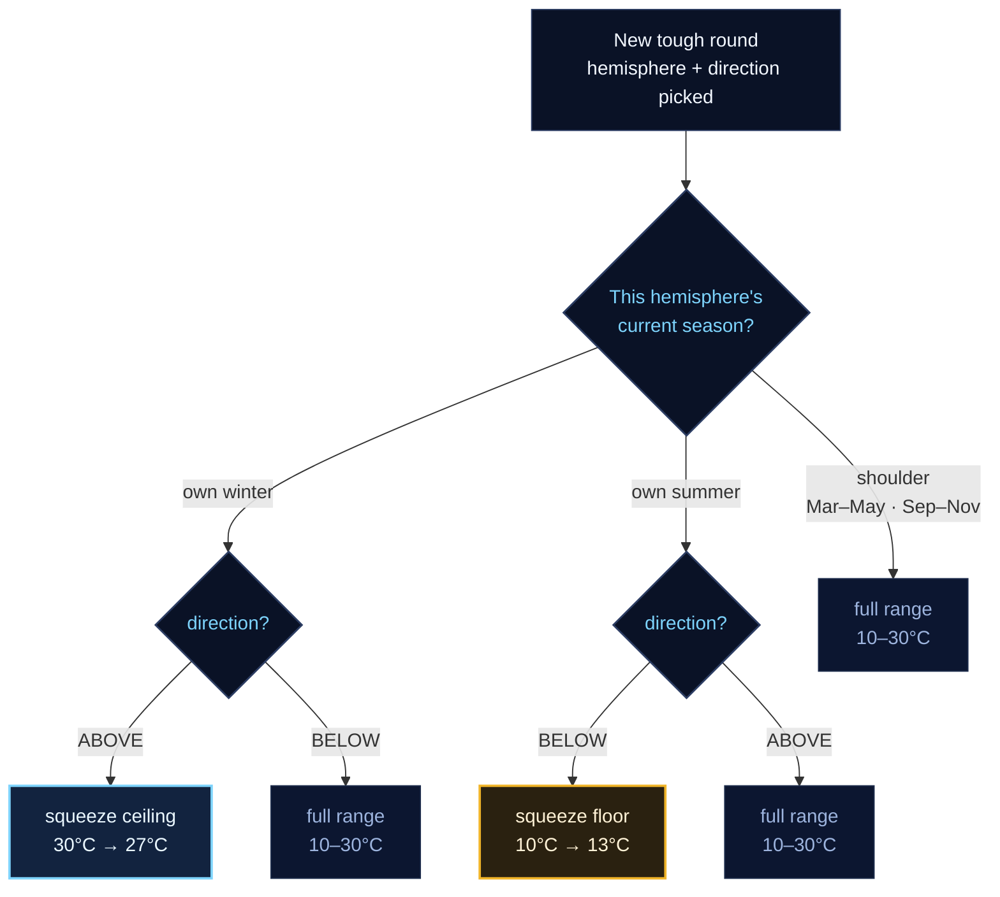

# The Seasonal Squeeze

Why a tough round's temperature range bends with the calendar, hemisphere by hemisphere.

A tough round (GeoStreak, question 11+) pins a temperature condition to
one hemisphere, unlike a plain round which any city on Earth can satisfy.
That's a problem for a fixed **10–30°C** range: in southern winter,
almost nothing south of the equator reads `ABOVE 30°C` outside a handful
of deep-tropical cities. `toughThresholdRange()` in
[`../app.js`](../app.js) now narrows whichever end of the range is
fighting its own hemisphere's season, and widens back out the moment it
isn't.

## Decision path

A round's hemisphere and direction are picked first; only then does the
current month narrow the range — and only on the combination that's
actually hard to satisfy this season.

- 🟦 **ceiling squeezed** — this hemisphere's own winter, direction ABOVE
- 🟨 **floor squeezed** — this hemisphere's own summer, direction BELOW
- ⬛ **full 10–30°C range** — every other combination, including both
  hemispheres during the Mar–May / Sep–Nov shoulder months

## Worked months

| Month | Northern · ABOVE | Northern · BELOW | Southern · ABOVE | Southern · BELOW |
|---|---|---|---|---|
| **April** (shoulder season) | 10–30°C | 10–30°C | 10–30°C | 10–30°C |
| **August** (N summer, S winter) | 10–30°C | **13–30°C** | **10–27°C** | 10–30°C |
| **December** (N winter, S summer) | **10–27°C** | 10–30°C | 10–30°C | **13–30°C** |

## Constants in play

| | |
|---|---|
| Base range | 10–30°C |
| Squeeze amount | 3°C |
| Northern summer window | Jun–Aug |
| Northern winter window | Dec–Feb |

Implemented in `toughThresholdRange()`, `FPL/vannilaWeatherApp/app.js` —
fixed 3-month meteorological blocks off the visitor's local calendar
month, not solstice-exact dates.
